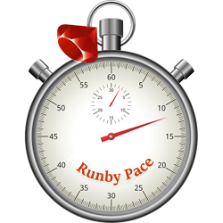

# RunbyOnRails
The open-source branch of the RunbyPace app (see https://runbypace.com). RunbyPace provides pace recommendations for different types of runs based on an individual runner's fitness level. This helps a runner get the most benefit from each type of run.

| | |
| --- | --- |
| **Build** |  |
| **Grade** | 

See the [Gemfile](Gemfile) for the requisite versions of Ruby and Rails.

## Up and developing
We use Docker Compose to ease development and deployment. Note that you will need to run Linux or Mac OSX. Expect to suffer if you are on Windows. Sorry.

### Run `bin/setup`
After cloning the repo, run [`bin/setup`](bin/setup) to set up things like Git hooks. (A post-commit hook is used to store the commit hash in `public/gitcommit.txt`)

### Set environment variables in .env files
[docker-compose.yml](docker-compose.yml) is configured to pull in environment variables from the `.env` files. Copy the `*.env.templates` files and remove the `.template` extension. Edit the files and enter your custom environment variables.

### Launching Docker Compose
* Ensure Docker is installed.
* `docker-compose up`
* `docker exec runbyonrails_runbyonrails_1 rails db:reset`
* `docker exec runbyonrails_runbyonrails_1 rails db:migrate`
* Visit http://localhost:3000 in a browser

### Run the tests
* `docker-compose up` (if you haven't already)
* `docker exec runbyonrails_runbyonrails_1 rake test`

## Contributing

Bug reports and pull requests are welcome on Gitlab at [https://gitlab.com/tygerbytes/RunbyOnRails](https://gitlab.com/tygerbytes/RunbyOnRails). However, I'm very busy so YMMV.

Contribute your ideas at [@runbypace](https://twitter.com/runbypace).

## Acknowledgements

Crafted with care, with the support of [JetBrains RubyMine](https://www.jetbrains.com/ruby/)

## License

The software is available as open source under the terms of the [MIT License](http://opensource.org/licenses/MIT).
